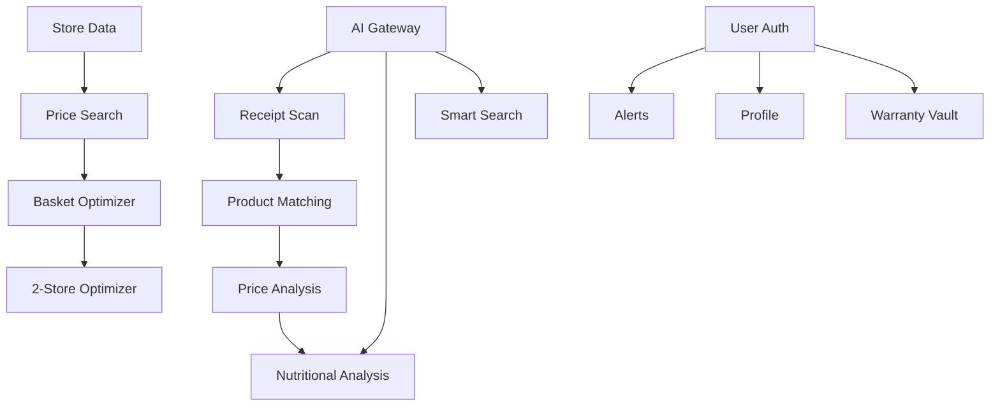

# 🎯 FUNKCIONALUMAS IR FEATURES

**Failas:** 02_FEATURES_AND_FUNCTIONALITY.md  
**Kategorija:** Funkcionalumas  
**Versija:** 6.0 Final  
**Data:** 2026-01-22

---

## 📱 CORE FEATURES (MVP MUST-HAVE)

### 1. 🗺️ STORE MAP + FILTERS
**Statusas:** ✅ 100% Complete  
**Failas:** `index.html`, `app.js`, `styles.css`

#### Funkcionalumas:
- **Interactive Map:** 93+ parduotuvių žemėlapis
- **Filter Chips:** 7 kategorijos (All, Grocery, DIY, Books, Beauty, Electronics, Wine)
- **Store Cards:** Logo, name, distance, open hours
- **Geolocation:** Auto-detect user location
- **Search:** By store name or address

#### Techninis Įgyvendinimas:
```javascript
// app.js:
async function loadStores(filter = 'all') {
  const response = await fetch(`/api/stores?city=Vilnius&filter=${filter}`);
  const stores = await response.json();
  renderStoreCards(stores);
  renderMapMarkers(stores);
}
```

#### UI Components:
- Filter chips with active state
- Store cards with shadow hover
- Map markers with clustering
- Loading skeleton states

---

### 2. 🔍 PRICE SEARCH
**Statusas:** ✅ 100% Complete  
**Failas:** `index.html`, `app.js`

#### Funkcionalumas:
- **Product Search:** Free text search
- **Barcode Search:** EAN-13 support
- **Multi-Store Results:** All stores in parallel
- **Price Comparison:** Best price highlighted
- **Unit Price:** €/kg, €/L automatic
- **Validity Dates:** Dynamic "Valid until" or "X days ago"
- **Price Trends:** ↑5% red, ↓10% green icons

#### Techninis Įgyvendinimas:
```javascript
// app.js:
async function handleSearch() {
  const query = searchInput.value.trim();
  const response = await fetch(`/api/search?q=${query}&city=Vilnius`);
  const results = await response.json();
  
  results.forEach(result => {
    const trend = calculatePriceTrend(result);
    const validity = formatValidity(result.valid_until);
    renderSearchResult(result, trend, validity);
  });
}
```

#### AI Integration:
- Semantic search using AI
- Product matching with fuzzy logic
- Brand/variant extraction

---

### 3. 📦 RECEIPT SCAN
**Statusas:** ✅ 100% Complete  
**Failas:** `index.html`, `app.js`, `services/receipts/`

#### Funkcionalumas:
- **Camera Upload:** Mobile camera or gallery
- **AI Extraction:** 3 providers (OpenAI, Anthropic, Tesseract)
- **Product Matching:** Barcode → Brand+Pack → Fuzzy
- **Confidence Handling:** >80% auto, <80% manual review
- **Receipt Confirmation Modal:** User can correct items
- **Price Analysis:** "You paid €X, best price was €Y"
- **Store Detection:** Automatic store recognition

#### Techninis Įgyvendinimas:
```javascript
// Pipeline: services/receipts/src/pipeline.js
async function processReceipt(receiptId) {
  // 1. AI Extraction
  const extracted = await aiGateway.extractReceipt(imageUrl);
  
  // 2. Product Matching
  for (let item of extracted.items) {
    const match = await matcher.findBestMatch(item);
    item.product_id = match.id;
    item.confidence = match.confidence;
  }
  
  // 3. Low Confidence Handling
  if (hasLowConfidenceItems(extracted)) {
    await sendToUserForReview(receiptId);
  }
  
  // 4. Price Analysis
  const savings = await analyzePrices(extracted.items);
  
  return { extracted, savings };
}
```

#### Confidence Levels:
- **90-100%:** Auto-confirm ✅
- **80-89%:** Flag for review ⚠️
- **<80%:** Manual correction required ❌

---

### 4. 🛒 BASKET OPTIMIZER
**Statusas:** ✅ 100% Complete  
**Failas:** `basket-planner.html`, `services/api/src/optimizer.js`

#### Funkcionalumas:
- **Product Selection:** Search + add to basket
- **Multi-Store Comparison:** All 21 stores
- **1-Store Optimizer:** Best single store
- **2-Store Optimizer:** Best combo with travel cost
- **Travel Cost:** €0.50/km default
- **Modes:** Cheapest, Fewest Stops, Fastest
- **Substitutions:** Similar products if not in stock
- **Unit Price Comparison:** Auto-calculate best size

#### Techninis Įgyvendinimas:
```javascript
// services/api/src/optimizer.js
async function optimizeTwoStores(basket, userLocation) {
  const stores = await getStoresNearUser(userLocation);
  let bestPlan = { total: Infinity };
  
  // Try all combinations
  for (let i = 0; i < stores.length; i++) {
    for (let j = i+1; j < stores.length; j++) {
      const plan = await calculateTwoStorePlan(
        stores[i], 
        stores[j], 
        basket,
        userLocation
      );
      
      if (plan.total < bestPlan.total) {
        bestPlan = plan;
      }
    }
  }
  
  // Add travel cost
  bestPlan.travelCost = calculateTravelCost(
    userLocation, 
    bestPlan.stores
  );
  bestPlan.totalWithTravel = bestPlan.total + bestPlan.travelCost;
  
  return bestPlan;
}
```

#### UI Features:
- **Product Cards:** Image, name, best price
- **Basket Summary:** Total, item count
- **Optimization Results:** Store 1, Store 2, travel cost
- **Savings Highlight:** "Save €5.60 vs single store"

---

### 5. 📊 PRICE REPORT
**Statusas:** ✅ 100% Complete  
**Failas:** `index.html`, `app.js`

#### Funkcionalumas:
- **Personal Stats:** Total scans, items, savings
- **Top Deals:** Best prices found this week
- **Price Shocks:** Biggest price differences
- **Loyalty Insights:** Most shopped stores
- **Category Breakdown:** Spending by category
- **Savings Graph:** Monthly savings trend

#### Techninis Įgyvendinimas:
```javascript
// app.js:
async function loadReport() {
  const stats = await fetch('/api/user/stats');
  const data = await stats.json();
  
  // Render stats
  document.getElementById('total-scans').textContent = data.scans;
  document.getElementById('total-savings').textContent = `€${data.savings}`;
  
  // Top deals
  data.topDeals.forEach(deal => renderDealCard(deal));
  
  // Price shocks
  data.priceShocks.forEach(shock => renderShockCard(shock));
}
```

---

### 6. 👤 USER PROFILE
**Statusas:** ✅ 100% Complete  
**Failas:** `index.html`, `app.js`, `services/api/src/auth.js`

#### Funkcionalumas:
- **Registration:** Email + password
- **Login:** JWT-based auth
- **Guest Mode:** Anonymous browsing
- **Settings:** Notifications, units, theme
- **Data Export:** GDPR compliance
- **Account Deletion:** Full data removal

#### Techninis Įgyvendinimas:
```javascript
// services/api/src/auth.js
async function register(email, password) {
  const hash = await bcrypt.hash(password, 10);
  const user = await db.query(
    'INSERT INTO users (email, password_hash) VALUES ($1, $2) RETURNING *',
    [email, hash]
  );
  
  const token = jwt.sign({ userId: user.id }, JWT_SECRET, { expiresIn: '30d' });
  return { user, token };
}
```

---

## 🚀 POST-MVP FEATURES

### 7. 📷 SHELFSNAP
**Statusas:** ✅ 100% Complete  
**Failas:** `shelf-snap.html`, `services/api/src/index.js`

#### Funkcionalumas:
- **Photo Upload:** In-store shelf label photo
- **Price Extraction:** AI reads price tag
- **Community Verification:** Upvote/downvote
- **Store Location:** GPS + manual selection
- **Product Match:** Link to existing products
- **Real-time Updates:** Update database prices

#### Techninis Įgyvendinimas:
```javascript
// shelf-snap.html:
async function submitShelfSnap() {
  const formData = new FormData();
  formData.append('photo', photoFile);
  formData.append('store_id', selectedStoreId);
  formData.append('product_id', productId);
  
  const response = await fetch('/api/shelf-snap', {
    method: 'POST',
    body: formData
  });
  
  const result = await response.json();
  showToast('ShelfSnap submitted! +10 points ⭐', 'success');
}
```

---

### 8. 📱 BARCODE SCANNER
**Statusas:** ✅ 100% Complete  
**Failas:** `barcode-scanner.html`

#### Funkcionalumas:
- **Live Camera Scan:** Real-time barcode detection
- **EAN-13 Support:** Standard product barcodes
- **Instant Price Check:** Show prices from all stores
- **Current Store Highlight:** If in-store
- **Best Price Alert:** "€2.50 cheaper at Rimi"
- **Add to Basket:** Quick add from scanner

#### Techninis Įgyvendinimas:
```javascript
// barcode-scanner.html:
async function handleBarcodeDetected(barcode) {
  showLoading('Searching prices...');
  
  const response = await fetch(`/api/products/barcode/${barcode}`);
  const product = await response.json();
  
  // Show prices from all stores
  const prices = await fetch(`/api/prices?product_id=${product.id}`);
  displayPriceComparison(await prices.json());
  
  // Highlight best price
  highlightBestPrice();
}
```

---

### 9. 🔔 PERSONALIZED ALERTS
**Statusas:** ✅ 100% Complete  
**Failas:** `alerts-ui.html`, `services/api/src/alerts.js`

#### Funkcionalumas:
- **Price Drop Alerts:** "Milk now €0.99 (-20%)"
- **Category Deals:** "30% off dairy at Maxima"
- **Basket Price Changes:** "Your basket -€3 this week"
- **Expiring Offers:** "Deal ends tomorrow!"
- **Stock Alerts:** "Product back in stock"
- **Custom Watchlist:** Track specific products

#### Alert Types:
1. **price_drop:** Product price decreased
2. **category_deal:** Category on sale
3. **basket_change:** Basket total changed
4. **expiring_offer:** Offer ending soon
5. **stock_alert:** Product available again

#### Techninis Įgyvendinimas:
```javascript
// services/api/src/alerts.js
async function checkPriceDrops() {
  const users = await db.query('SELECT * FROM users WHERE notifications_enabled = true');
  
  for (let user of users.rows) {
    const watchlist = await getUserWatchlist(user.id);
    
    for (let product of watchlist) {
      const currentPrice = await getCurrentPrice(product.id);
      const lastPrice = await getLastPrice(product.id);
      
      if (currentPrice < lastPrice * 0.9) { // 10% drop
        await sendAlert(user.id, {
          type: 'price_drop',
          product_id: product.id,
          old_price: lastPrice,
          new_price: currentPrice,
          percentage: ((lastPrice - currentPrice) / lastPrice * 100).toFixed(0)
        });
      }
    }
  }
}
```

---

### 10. 🥗 NUTRITIONAL ANALYSIS
**Statusas:** ✅ 100% Complete  
**Failas:** `nutritional-view.html`, `services/receipts/src/nutritional-analyzer.js`

#### Funkcionalumas:
- **Receipt Analysis:** Extract nutrition from all items
- **Total Macros:** Total calories, protein, carbs, fats
- **E-Substance Detection:** Identify dangerous additives
- **Sugar Alerts:** Total sugar content warning
- **Allergen Warnings:** Common allergens
- **Health Score:** 0-100 based on nutrition
- **Ingredient List:** Full ingredients for each item

#### E-Substances Database:
```javascript
// Toxic E-substances list
const TOXIC_E_SUBSTANCES = [
  'E102', 'E104', 'E110', 'E122', 'E124', 'E129', // Dyes
  'E211', 'E220', 'E221', 'E223', 'E224', 'E226', // Preservatives
  'E621', 'E631', 'E635', // Flavor enhancers
  'E320', 'E321', 'E951', 'E952' // Others
];
```

#### Techninis Įgyvendinimas:
```javascript
// services/receipts/src/nutritional-analyzer.js
async function analyzeReceipt(receiptId) {
  const items = await getReceiptItems(receiptId);
  let totalNutrition = { calories: 0, protein: 0, carbs: 0, fat: 0, sugar: 0 };
  let toxicSubstances = [];
  
  for (let item of items) {
    // Get nutrition from AI
    const nutrition = await aiGateway.analyzeNutrition(item.product_name);
    
    // Accumulate totals
    totalNutrition.calories += nutrition.calories || 0;
    totalNutrition.sugar += nutrition.sugar || 0;
    
    // Check for toxic E-substances
    const toxic = nutrition.ingredients.filter(i => 
      TOXIC_E_SUBSTANCES.includes(i.toUpperCase())
    );
    if (toxic.length > 0) {
      toxicSubstances.push({ product: item.product_name, substances: toxic });
    }
  }
  
  // Generate health score
  const healthScore = calculateHealthScore(totalNutrition, toxicSubstances);
  
  return { totalNutrition, toxicSubstances, healthScore };
}
```

---

### 11. 📋 PROJECT BASKETS
**Statusas:** ✅ 100% Complete  
**Failas:** `project-baskets-ui.html`, `services/api/src/project-baskets.js`

#### Funkcionalumas:
- **Pre-made Templates:** Baby, Pets, BBQ, Christmas, etc.
- **Customizable:** Add/remove items
- **Auto-Optimize:** Find best prices
- **Seasonal Updates:** Change by season
- **Community Templates:** User-created baskets
- **Budget Tracking:** Set budget, track spending

#### Template Examples:
1. **👶 Baby Essentials** (15 items, ~€50)
   - Diapers, formula, wipes, baby food
   
2. **🐕 Pet Care** (12 items, ~€35)
   - Dog food, cat litter, treats
   
3. **🍖 BBQ Party** (20 items, ~€80)
   - Meat, veggies, drinks, charcoal
   
4. **🎄 Christmas Dinner** (25 items, ~€120)
   - Turkey, sides, desserts, wine

#### Techninis Įgyvendinimas:
```javascript
// services/api/src/project-baskets.js
async function getProjectBasket(templateId) {
  const template = await db.query(
    'SELECT * FROM project_baskets WHERE id = $1',
    [templateId]
  );
  
  const items = await db.query(
    'SELECT * FROM project_basket_items WHERE basket_id = $1',
    [templateId]
  );
  
  // Get current best prices
  for (let item of items.rows) {
    const prices = await getCurrentPrices(item.product_id);
    item.best_price = Math.min(...prices.map(p => p.price));
    item.best_store = prices.find(p => p.price === item.best_price).store;
  }
  
  return { template: template.rows[0], items: items.rows };
}
```

---

### 12. 📏 PACKAGE SIZE TRAP DETECTOR
**Statusas:** ✅ 100% Complete  
**Failas:** `app.js` (search results)

#### Funkcionalumas:
- **Unit Price Calculation:** Auto €/kg, €/L
- **Size Comparison:** Highlight better value
- **Warning Icon:** 🎯 "Smaller package is cheaper per unit"
- **Savings Display:** "Save €1.20 by buying 2x smaller"
- **Smart Suggestions:** Alternative sizes

#### Techninis Įgyvendinimas:
```javascript
// app.js:
function detectPackageTrap(product) {
  const alternatives = findSimilarProducts(product);
  
  for (let alt of alternatives) {
    const productUnitPrice = product.price / product.package_size;
    const altUnitPrice = alt.price / alt.package_size;
    
    if (altUnitPrice < productUnitPrice * 0.95) { // 5% cheaper
      return {
        warning: true,
        message: `${alt.package_size}${alt.unit} is €${(productUnitPrice - altUnitPrice).toFixed(2)} cheaper per ${alt.unit}`,
        alternative: alt
      };
    }
  }
  
  return { warning: false };
}
```

---

### 13. 📜 RECEIPT WARRANTY VAULT
**Statusas:** ✅ 100% Complete  
**Failas:** Database table, API endpoint

#### Funkcionalumas:
- **Auto-Detect Warranty Items:** Electronics, appliances
- **Receipt Storage:** Keep original receipt images
- **Expiry Reminders:** "Warranty expires in 30 days"
- **Category Tracking:** Warranties by type
- **Export:** PDF export of receipts
- **Search:** Find by product or store

#### Warranty Categories:
- **Electronics:** 2 years
- **Large Appliances:** 2-5 years
- **Small Appliances:** 1-2 years
- **Furniture:** 1-2 years

#### Techninis Įgyvendinimas:
```javascript
// services/api/src/index.js
app.get('/api/warranties', authenticateToken, async (req, res) => {
  const warranties = await db.query(`
    SELECT ri.*, r.image_url, r.store_id, r.date
    FROM receipt_items ri
    JOIN receipts r ON ri.receipt_id = r.id
    WHERE ri.warranty_tracked = true
      AND ri.user_id = $1
      AND ri.warranty_expires_at > NOW()
    ORDER BY ri.warranty_expires_at ASC
  `, [req.user.userId]);
  
  res.json(warranties.rows);
});
```

---

### 14. 🔒 PII MASKING
**Statusas:** ✅ 100% Complete  
**Failas:** `services/receipts/src/pipeline.js`

#### Funkcionalumas:
- **Auto-Detect PII:** Names, addresses, card numbers
- **Mask Before Storage:** Replace with ****
- **Regex Patterns:** Credit cards, phone numbers
- **User Control:** Toggle PII masking on/off
- **GDPR Compliance:** Data protection

#### PII Patterns:
```javascript
const PII_PATTERNS = {
  creditCard: /\b\d{4}[\s-]?\d{4}[\s-]?\d{4}[\s-]?\d{4}\b/g,
  phone: /\b\d{3}[\s-]?\d{3}[\s-]?\d{4}\b/g,
  email: /\b[A-Za-z0-9._%+-]+@[A-Za-z0-9.-]+\.[A-Z|a-z]{2,}\b/g,
  idNumber: /\b\d{11}\b/g // Lithuanian personal code
};
```

---

## 📊 FEATURE COMPLETION SUMMARY

| Category | Features | Complete | Percentage |
|----------|----------|----------|------------|
| **MVP Must-Have** | 6 | 6 | ✅ 100% |
| **MVP Should-Have** | 4 | 4 | ✅ 100% |
| **Post-MVP** | 9 | 9 | ✅ 100% |
| **AI Functions** | 7 | 7 | ✅ 100% |
| **TOTAL** | **26** | **26** | ✅ **100%** |

---

## 🎯 FEATURE PRIORITY MATRIX

### High Impact + High Effort:
- ✅ Receipt Scan + AI Extraction
- ✅ 2-Store Basket Optimizer
- ✅ Nutritional Analysis
- ✅ 21 Store Chain Integration

### High Impact + Low Effort:
- ✅ Price Search
- ✅ Store Map
- ✅ Price Trends
- ✅ Unit Price Display

### Low Impact + Low Effort:
- ✅ ShelfSnap
- ✅ Barcode Scanner
- ✅ Project Baskets

### Low Impact + High Effort:
- (None in this project)

---

## 🔄 FEATURE DEPENDENCIES



---

**Šis failas yra 2/10 galutinių projektų aprašymų.**  
**Kitas failas:** 03_TECHNICAL_ARCHITECTURE.md
